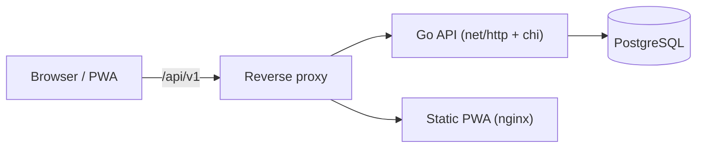

# Contacts

A self-hosted contact management system. It exposes a RESTful Go API backed by
PostgreSQL and ships an installable React PWA for managing contacts. The primary
deployment artifact is a set of container images.

> v2 scope: a single `Person` entity with standard fields plus user-defined
> custom fields, full CRUD via API and UI, and optional Authentik OIDC SSO.
> When Authentik is configured, each account can access only its own contacts.

## Architecture



- **Backend** — Go (`net/http` + [chi] router), [pgx] for PostgreSQL access,
  [golang-migrate] for schema migrations. Structured logging via `slog`.
- **Frontend** — React + Vite + TypeScript, installable PWA (no offline support
  in v1), served by nginx.
- **Database** — PostgreSQL, a single database with a `persons` table. Custom
  fields are stored in a `JSONB` column.
- **Delivery** — Docker images for backend and frontend; a deployment-oriented
  Docker Compose stack plus a local source-build override; GitHub Actions for
  CI and tagged releases.

[chi]: https://github.com/go-chi/chi
[pgx]: https://github.com/jackc/pgx
[golang-migrate]: https://github.com/golang-migrate/migrate

## Quickstart

### Option A — Dev container (recommended)

1. Open the repository in VS Code and choose **Reopen in Container**.
2. The container installs the Go toolchain, Node, linters, and migration
   tooling automatically (`.devcontainer/post-create.sh`).
3. Start the stack:

   ```bash
   cp .env.example .env
   make up
   ```

`make up` uses `docker-compose.dev.yml` on top of the default deployment stack
so backend and frontend changes are built from the local source tree. If
`secrets/db_password` does not exist yet, the Make target creates it from
`DB_PASSWORD` for local use.

### Option B — Docker Compose

```bash
cp .env.example .env
mkdir -p secrets
printf 'change-me\n' > secrets/db_password
docker compose up -d
```

The compose stack pulls published images by default:

- `ghcr.io/scottfridwin/contacts-backend:${CONTACTS_VERSION:-latest}`
- `ghcr.io/scottfridwin/contacts-frontend:${CONTACTS_VERSION:-latest}`

Override `CONTACTS_VERSION` in `.env` to pin a specific release such as
`v1.0.0` or `1.0.0`. You can also override `BACKEND_IMAGE` or
`FRONTEND_IMAGE` explicitly if you mirror the images elsewhere.

The default deployment compose file is hardened to run with explicit non-root
`user:` settings, `read_only: true`, targeted `tmpfs` mounts for writable paths,
and baseline `mem_limit` / `pids_limit` values for each service.

The frontend nginx proxy target is configured at container startup with
`API_UPSTREAM`, so deployments can point the frontend image at a differently
named backend service without rebuilding the image.

For local development without pulling published application images, use:

```bash
docker compose -f docker-compose.yml -f docker-compose.dev.yml up --build
```

Services:

- API: http://localhost:8080 (health at `/healthz`, readiness at `/readyz`)
- Frontend: http://localhost:5173
- PostgreSQL: localhost:5432

## Configuration reference

The backend is configured entirely through environment variables.

| Variable               | Default     | Description                                             |
| ---------------------- | ----------- | ------------------------------------------------------- |
| `PORT`                 | `8080`      | HTTP listen port.                                       |
| `LOG_LEVEL`            | `info`      | `debug`, `info`, `warn`, or `error`.                    |
| `ENV`                  | `production`| `production` → JSON logs; anything else → text logs.    |
| `DB_HOST`              | _(required)_| PostgreSQL host.                                        |
| `DB_PORT`              | `5432`      | PostgreSQL port.                                        |
| `DB_USER`              | _(required)_| PostgreSQL user.                                        |
| `DB_PASSWORD`          | —           | PostgreSQL password (see precedence below).             |
| `DB_PASSWORD_FILE`     | —           | Path to a file with the password (Docker secrets).      |
| `DB_PASSWORD_SECRET_FILE` | `./secrets/db_password` | Host path for the Compose-mounted Docker secret. |
| `DB_NAME`              | `postgres`  | Database name.                                          |
| `DB_SSLMODE`           | `disable`   | `libpq` sslmode.                                        |
| `CORS_ALLOWED_ORIGINS` | dev origins | Comma-separated allow-list of browser origins.          |
| `PURGE_AFTER_DAYS`     | `30`        | Recycle-bin retention before soft-deleted rows purge.   |
| `AUTHENTIK_ISSUER`     | —           | Authentik OIDC issuer/discovery URL; enables SSO.        |
| `AUTHENTIK_CLIENT_ID`  | —           | Authentik OAuth client ID.                              |
| `AUTHENTIK_CLIENT_SECRET_FILE` | —    | Docker secret file for the OAuth client secret.         |
| `AUTHENTIK_CLIENT_SECRET` | —        | Inline OAuth client secret fallback.                    |
| `AUTHENTIK_REDIRECT_URL` | —         | Backend callback URL (`/auth/callback`).                |
| `GOOGLE_CLIENT_ID`   | —           | Google OAuth client ID for contact sync.                 |
| `GOOGLE_CLIENT_ID_FILE` | —        | Docker secret file for Google OAuth client ID.           |
| `GOOGLE_CLIENT_SECRET` | —         | Google OAuth client secret for contact sync.             |
| `GOOGLE_CLIENT_SECRET_FILE` | —    | Docker secret file for Google OAuth client secret.       |
| `GOOGLE_REDIRECT_URL` | —          | Backend Google sync callback URL (`/api/v1/sync/google/callback`). |
| `SESSION_SECRET_FILE`   | —           | Docker secret file containing a 32+ byte session key.   |
| `SESSION_SECRET`        | —           | Inline session key fallback.                            |
| `CONTACTS_VERSION`     | `latest`    | Tag used for both published application images.         |
| `BACKEND_IMAGE`        | GHCR image  | Optional override for the backend image repository.     |
| `FRONTEND_IMAGE`       | GHCR image  | Optional override for the frontend image repository.    |
| `APP_PUBLISH_PORT`     | `8080`      | Host port mapped to the backend container.              |
| `FRONTEND_PUBLISH_PORT`| `5173`      | Host port mapped to the frontend container.             |
| `POSTGRES_PUBLISH_PORT`| `5432`      | Host port mapped to PostgreSQL.                         |
| `API_UPSTREAM`         | `http://app:8080` | Runtime nginx upstream for `/api` proxying.          |
| `POSTGRES_UID` / `POSTGRES_GID` | `70` / `70` | UID/GID used for the PostgreSQL container.      |
| `APP_UID` / `APP_GID`  | `65532` / `65532` | UID/GID used for the backend container.          |
| `FRONTEND_UID` / `FRONTEND_GID` | `101` / `101` | UID/GID used for the frontend container.     |
| `POSTGRES_MEM_LIMIT`   | `512m`      | Memory limit for PostgreSQL.                            |
| `POSTGRES_PIDS_LIMIT`  | `256`       | PID limit for PostgreSQL.                               |
| `APP_MEM_LIMIT`        | `256m`      | Memory limit for the backend API.                       |
| `APP_PIDS_LIMIT`       | `128`       | PID limit for the backend API.                          |
| `FRONTEND_MEM_LIMIT`   | `128m`      | Memory limit for the frontend nginx container.          |
| `FRONTEND_PIDS_LIMIT`  | `64`        | PID limit for the frontend nginx container.             |

Google OAuth requests the `contacts`, `openid`, and `email` scopes. The
`openid`/`email` scopes are used only to identify which Google account is
connected (so more than one can be distinguished in the UI); they are not
used to read any other profile data.

Frontend build-time variable:

| Variable            | Default | Description                              |
| ------------------- | ------- | ---------------------------------------- |
| `VITE_API_BASE_URL` | `""`    | Base URL of the API (empty = same host). |

**Secret precedence:** if both `DB_PASSWORD_FILE` and `DB_PASSWORD` are set, the
file wins. In the default Compose deployment, Postgres and the backend both read
the password from the `db_password` Docker secret mounted from
`DB_PASSWORD_SECRET_FILE`. If neither is set, startup fails with an explicit
error. All logs go to stdout/stderr only — the container runtime owns log
collection.

### Authentik SSO

Set all Authentik and session variables to enable OIDC authorization-code login.
The application exposes `GET /auth/login`, `GET /auth/callback`, and
`POST /auth/logout`. Client and session secrets support Docker secret files,
which take precedence over inline values. Once enabled, unauthenticated API
requests receive `401`, and all Person reads and writes are scoped to the
authenticated Authentik subject.

## Data model

A `Person` has:

- `id` (server-generated UUID), `first_name`, `last_name` (required)
- `middle_names` (optional ordered array of strings)
- `display_name` (optional; derived from the name parts when blank)
- `nickname`, `pronouns` (optional strings)
- `birthdate` (optional ISO-8601 date string, `YYYY-MM-DD`)
- `emails` (optional array of labeled entries, max 10: `{label, value}`, value
  must be a valid email address)
- `phone_numbers` (optional array of labeled entries, max 10: `{label,
  value}`, e.g. `{"label": "mobile", "value": "+1-555-0100"}`)
- `addresses` (optional array of structured entries, max 10: `{label, street,
  city, region, postal_code, country}`)
- `organization` (optional single object: `{name, title, department}`)
- `notes` (optional free-text string, max 4096 chars)
- `custom_fields` (JSONB map)
- `is_favorite` (boolean, default false) - starred contacts are shown in an
  always-visible Favorites section in the UI, separate from the main list's
  page/sort/search
- `is_owner` (read-only boolean) - `false` when the Person is shared with you
  by another account rather than owned by you
- `owner_display_name` (read-only, optional) - set only when `is_owner` is
  `false`, showing who shared the contact
- `created_at`, `updated_at`, `deleted_at` (soft delete)

**Custom fields policy:** lowercase `snake_case` keys; scalar values of type
string, number, boolean, or date; max 64 fields; key max 64 chars; string value
max 1024 chars. JSON has no date type, so dates are ISO-8601 strings
(`YYYY-MM-DD` or RFC 3339). `null` values are rejected — omit a field to remove
it.

**Relationships:** a `Person` can be related to another `Person` (or, if the
other person isn't in your contacts, just a free-text name) via one of five
fixed types: `parent`, `child`, `spouse`, `sibling`, `partner` (no custom
types). A single relationship is stored from the creating person's
perspective; the reverse side is computed automatically (e.g. "A is Parent of
B" also shows as "B is Child of A" without a second stored row - Spouse/
Sibling/Partner are symmetric). Manage relationships via `GET/POST
/persons/{id}/relationships` and `DELETE /persons/{id}/relationships/{relationshipId}`
(there is no update endpoint - delete and recreate to change a relationship's
type). Google sync only stores a relation as a free-text name with no link to
a real record; on import we link to an existing contact only when its display
name matches exactly and unambiguously, otherwise the relationship is kept as
name-only so the information isn't lost.

**Delete behavior:** soft delete with recycle-bin semantics. Deleted records are
excluded from reads and permanently purged after `PURGE_AFTER_DAYS` (default 30)
by a background job.

**Sharing:** an owner can share an individual contact with another account by
exact email match (the recipient must have logged in at least once). The
recipient gets view and edit access to the same record (not a copy) - it
appears merged into their own list with a "Shared by ..." badge, and is
included in their own Google sync export. Deleting, restoring, managing
relationships, and managing shares on that Person remain owner-only actions.
A recipient can remove their own access at any time without the owner's
involvement. A single contact can be shared with at most 50 accounts, and can
have at most 50 relationships recorded from its own perspective. Manage
shares via `GET/POST /persons/{id}/shares`, `DELETE
/persons/{id}/shares/{shareId}` (owner-only), and
`DELETE /persons/{id}/shares/mine` (recipient self-removal).

## API

- Base path: `/api/v1`
- Endpoints: `POST/GET /persons`, `GET/PATCH/DELETE /persons/{id}`, `GET /persons/deleted`,
  `POST /persons/{id}/restore`, and `DELETE /persons/{id}/permanent`
- Relationships: `GET/POST /persons/{id}/relationships`, `DELETE
  /persons/{id}/relationships/{relationshipId}`
- Sharing: `GET/POST /persons/{id}/shares`, `DELETE /persons/{id}/shares/{shareId}`
  (owner-only), `DELETE /persons/{id}/shares/mine` (recipient self-removal)
- Rate limiting: share creation and login are limited per client IP (20/minute
  each) to slow down abuse; over the limit returns `429`.
- Sync account management: `GET/POST /sync-accounts`, `GET/PATCH/DELETE /sync-accounts/{id}`
- Google sync OAuth: `GET /sync/google/begin`, `GET /sync/google/callback`
- Multiple Google accounts can be connected at once (via the sync drawer's
  "Add Google account" action); each connected account mirrors the full
  contact list both ways. Accounts are identified by the Google account's
  stable subject id and labeled in the UI with the connected email.
- Only the fixed built-in `Person` fields are synced with Google (name,
  emails, phone numbers, addresses, organization, notes, nickname,
  birthdate, relationships); `custom_fields` are local-only and are not
  pushed to or pulled from Google. A contact's own custom fields set up
  directly in Google Contacts are left untouched by our sync.
- Frontend sync panel: connect Google and review sync status from the main app UI
- Public privacy policy: `GET /privacy`
- Public homepage purpose page: `GET /` remains readable without authentication and
  explains what the app does (required for Google OAuth verification)
- List defaults: page size 25 (max 100), default sort `last_name, first_name asc`,
  filters `first_name`, `last_name`, and `favorite` (boolean).
- The recycle bin lists soft-deleted contacts and supports restoring or permanently
  deleting them before the retention purge.
- OpenAPI specification: [api/openapi.yaml](api/openapi.yaml) (validated in CI).

Google callback behavior:
- Browser callback requests receive a human-friendly completion page and popup
  close flow.
- API clients requesting JSON receive JSON account data.

### Diagnosing Google sync issues

The backend logs sync activity as structured JSON to stdout
(`docker logs <backend-container>` / `docker compose logs app`). Look for:

- `"msg":"google sync starting"` / `"msg":"google sync finished"` — one pair
  per sync attempt, with `account_id` and (on finish) `remote_records_seen`.
  If `remote_records_seen` is `0`, the Google account genuinely has nothing
  new under "My Contacts" to import (a different Google account/browser tab
  is often the cause — Google's People API only reads "My Contacts", not
  "Other contacts").
- `"msg":"google sync fetched remote page"` — logged per page fetched from
  Google, with the `records` count returned by that page.
- `"msg":"google sync exported local contacts"` — logged once, only during
  the very first sync for an account, with the number of local contacts
  pushed up to Google.
- `"msg":"google sync failed"` (error level) — includes the underlying error;
  the same message is also shown as "Last error" under the account in the
  sync drawer.
- `"msg":"reconciling due sync account"` — logged each time the periodic
  reconciliation loop decides an account's configured frequency has elapsed
  and triggers another sync; if you never see this after the initial connect,
  periodic sync isn't running.

## Development commands

Run `make help` for the full list.

| Command                  | Description                                    |
| ------------------------ | ---------------------------------------------- |
| `make up` / `make down`  | Start / stop the local source-build stack.     |
| `make up-deploy`         | Start the published-image deployment stack.    |
| `make backend-test`      | Backend unit tests.                            |
| `make backend-cover`     | Backend tests with the 70% coverage gate.      |
| `make backend-integration` | Integration tests (needs `TEST_DATABASE_URL`). |
| `make backend-lint`      | Run `golangci-lint`.                            |
| `make backend-fmt`       | Format Go code.                                 |
| `make migrate-up`        | Apply migrations (uses `DATABASE_URL`).         |
| `make frontend-test`     | Frontend unit tests (Vitest).                   |
| `make frontend-lint`     | Lint the frontend (ESLint).                     |
| `make frontend-build`    | Production build.                               |
| `make e2e`               | Playwright create/edit end-to-end test.         |

## Testing

- **Backend:** unit tests for config, validation, and service logic; endpoint
  tests over the full router; PostgreSQL integration tests behind the
  `integration` build tag. CI enforces a 70% coverage minimum on the business
  packages (`config`, `httpapi`, `person`).
- **Frontend:** Vitest component and validation tests; a Playwright end-to-end
  create → edit flow.

## Release process

Versioning follows [Semantic Versioning](https://semver.org/). The pipeline uses
a **build-once, promote** model (workflow: `.github/workflows/build.yml`):

1. **Every push to `main`** builds multi-arch images and publishes them to GitHub
   Container Registry tagged `main` and `sha-<shortsha>`:
   - `ghcr.io/scottfridwin/contacts-backend`
   - `ghcr.io/scottfridwin/contacts-frontend`
2. **To cut a release**, run the *Build and Publish Docker Images* workflow
   manually (Actions → Run workflow) from `main` with a `release_tag` like
   `v1.0.0`. This **promotes the current `main` image** (re-tags the existing
   manifest with `crane` — no rebuild) to `vX.Y.Z`, `X.Y.Z`, and `latest`, then
   creates the matching git tag and a GitHub Release.

Releases are intentionally decoupled from rebuilds so the exact artifact tested
on `main` is the one shipped. Pull requests run tests only; images are never
published from a PR.


## License

[Apache-2.0](LICENSE). Commercial use is permitted.
